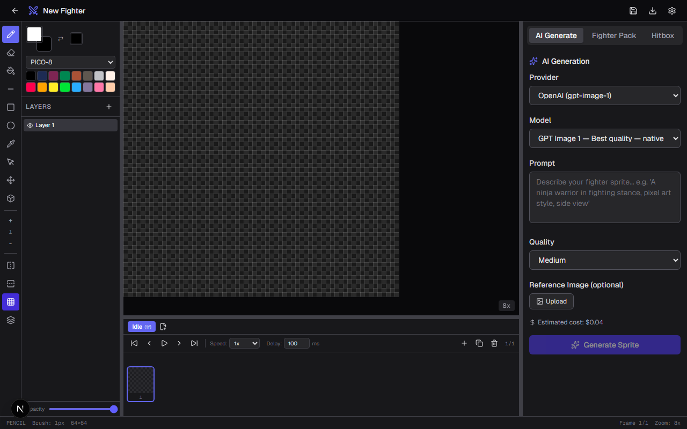
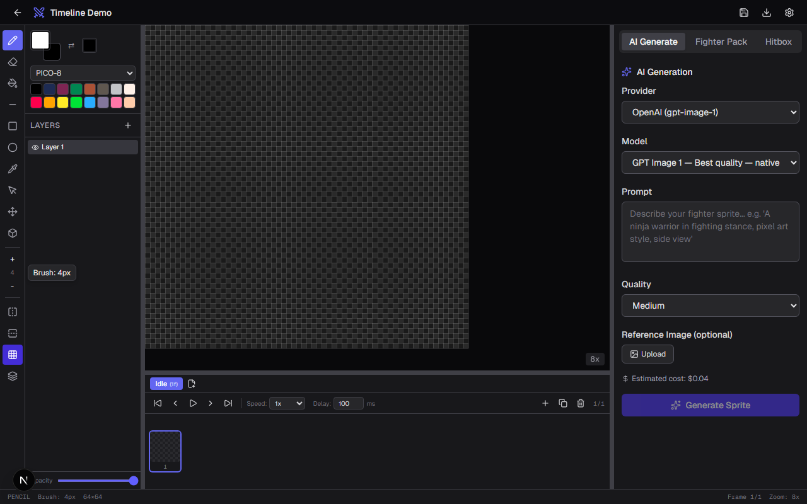
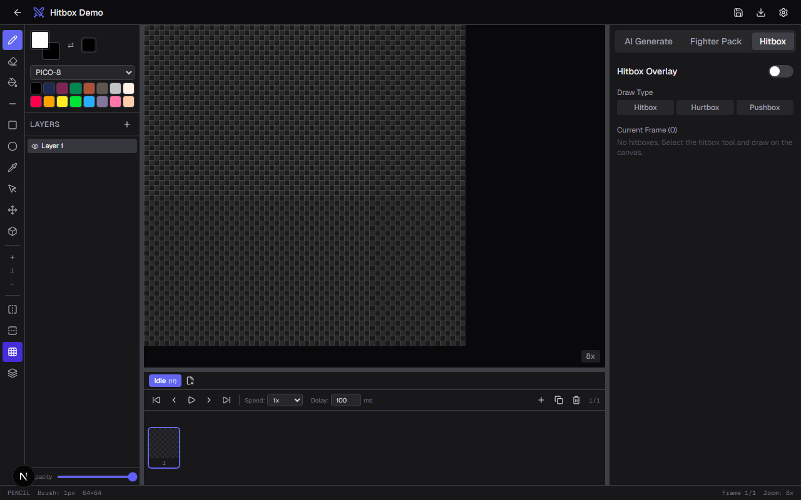
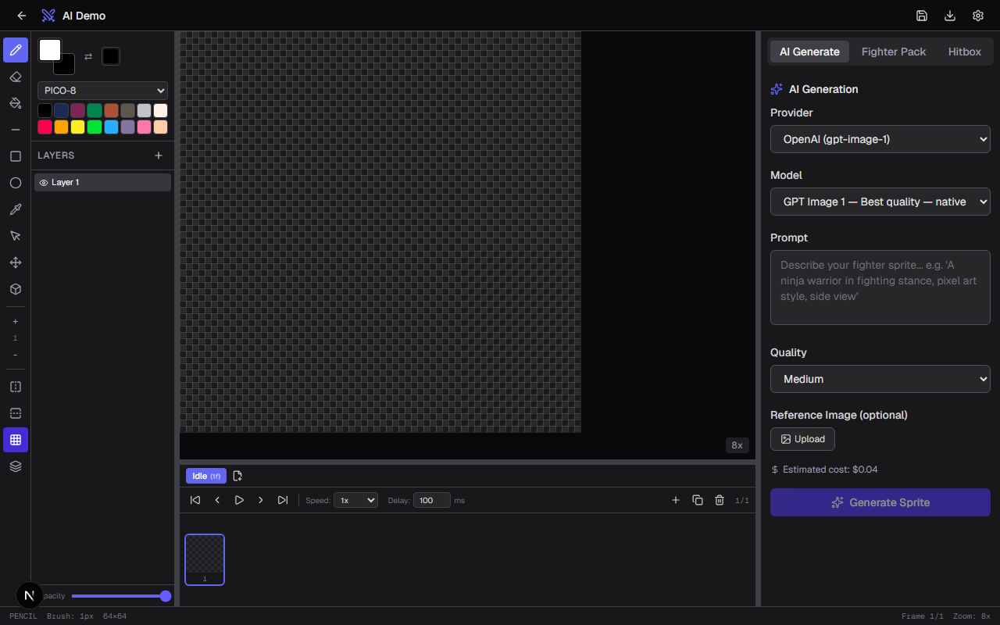
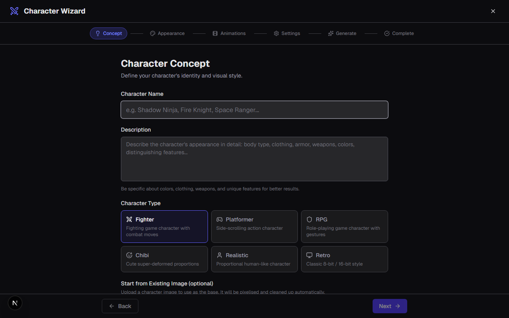
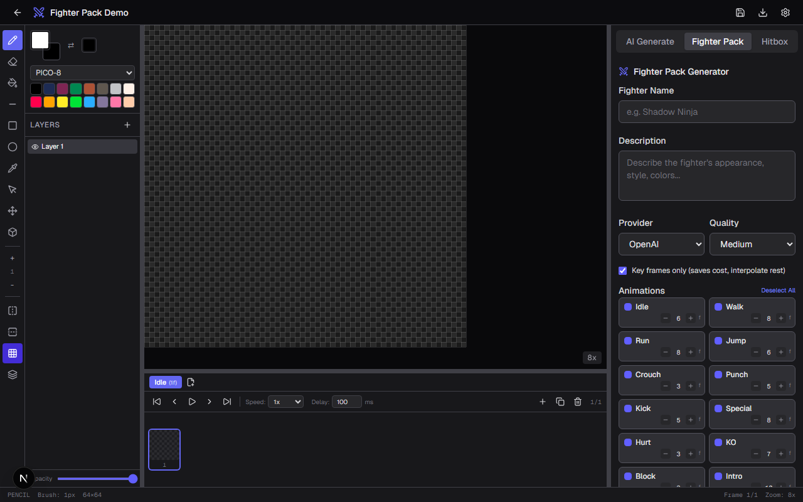
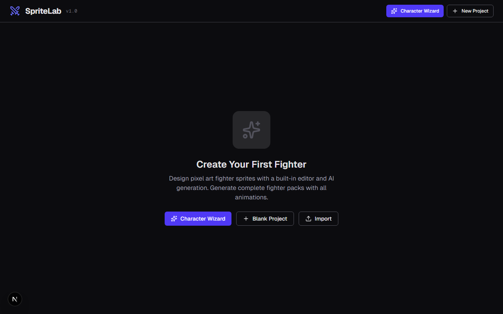

# SpriteLab v0.1.0 — Release Notes

> Pixel-art sprite editor with AI-powered generation, animation tools, and fighter-pack workflows.

---

## Highlights

SpriteLab v0.1.0 is the first public release — a browser-based sprite editor purpose-built for 2D fighting game characters (and any pixel-art project). It combines a full-featured canvas editor, frame-based animation, hitbox editing, and AI-assisted generation into a single app.

---

## Features

### Pixel-Art Editor

A multi-layer canvas with zoom, pan, grid overlay, and mirror mode. Drawing tools include pencil, eraser, flood fill, line, rectangle, ellipse, and a color picker. Sprite sizes range from 16×16 to 256×256.

<!-- Screenshot: editor view with canvas, layers panel, and color palette visible -->
<!-- Suggested image: capture the editor at /editor/<projectId> with a sprite on canvas, layer panel open on the left, color panel on the right -->



### Animation Timeline

Frame-based timeline with play/pause, per-frame delay control, and loop/ping-pong modes. Each frame has its own independent layer stack. Onion skin overlay lets you see adjacent frames while drawing.

<!-- Screenshot: timeline bar at the bottom showing multiple frames, with onion skin enabled -->



### Hitbox Editor

Three hitbox types — **hitbox** (red), **hurtbox** (green), and **pushbox** (blue) — drawn directly on the canvas. Propagate hitboxes to the next frame or all frames in one click.

<!-- Screenshot: canvas with colored hitbox overlays visible on a character sprite -->



### AI-Powered Generation

Generate sprites from text prompts using OpenAI or Google Gemini. Choose between low, medium, and high quality tiers with live cost estimates. Supply a reference image for guided generation.

<!-- Screenshot: generation panel open with a prompt entered, showing quality selector and cost estimate -->



### Character Wizard

A guided 6-step workflow that walks you from concept through appearance, animation selection, settings, AI generation, and completion — producing a full animated sprite pack from a single description.

<!-- Screenshot: wizard page showing the step progress bar and the concept/appearance input step -->



### Fighter Pack Generator

Batch-generate complete animation sets (idle, walk, attack, jump, etc.) for a fighting-game character. Streaming progress, customizable frame counts per animation, and consistent style across the full pack.

<!-- Screenshot: fighter pack panel with animation list and generation progress bars -->



### Export

Export individual frames as PNG, animated GIFs (with frame delay and scale controls), or sprite sheets (horizontal, vertical, or auto-packed layout). Batch export with progress tracking.

<!-- Screenshot: export dialog showing format options (PNG, GIF, Sprite Sheet) -->


### Project Management

Create, open, import, and delete projects from the home screen. Projects are stored in the browser via IndexedDB (Dexie). Each project card shows a thumbnail preview.

<!-- Screenshot: home page showing project cards with thumbnails and the "New Project" dialog -->



---

## Tech Stack

| Layer        | Technology                                  |
|-------------|---------------------------------------------|
| Framework   | Next.js 16 (App Router, Turbopack)          |
| UI          | React 19, Tailwind CSS 4, Lucide icons      |
| State       | Zustand                                      |
| Local DB    | Dexie (IndexedDB)                            |
| Auth        | NextAuth v5 (credentials + OAuth)            |
| Server DB   | PostgreSQL + Prisma 7                        |
| AI          | OpenAI API, Google Gemini API                |
| Export      | gif.js, JSZip, maxrects-packer               |
| Deployment  | Docker (multi-stage) + docker-compose        |

---

## Getting Started

### Local Development

```bash
npm install
cp .env.example .env   # fill in DATABASE_URL, API keys
npx prisma generate
npm run dev             # → http://localhost:3000
```

Or use the quick-start script:

```bat
start.bat
```

### Docker

```bash
cd docker
docker-compose up --build
```

This starts the app on port 3000 with a PostgreSQL database.

---

## Release Script

A PowerShell script automates the full release workflow:

```powershell
.\release.ps1               # full: lint → build → docker → tag → push
.\release.ps1 -SkipDocker   # skip Docker image build
.\release.ps1 -SkipBuild    # skip Next.js build verification
.\release.ps1 -SkipPush     # create tag locally without pushing
.\release.ps1 -Help         # show all options
```

**Steps performed:**

1. Validates prerequisites (Node.js, npm, git, clean tree)
2. Prompts for version number (semver)
3. Runs `tsc --noEmit` and `eslint` (skip with `-SkipLint`)
4. Updates version in `package.json`
5. Runs `npm run build` to verify production bundle (skip with `-SkipBuild`)
6. Builds Docker image `spritelab:<version>` (skip with `-SkipDocker`)
7. Commits version change and creates `v<version>` git tag
8. Pushes to origin (skip with `-SkipPush`)

On failure, the script restores `package.json` from backup automatically.

---

## Adding Screenshots

To populate the screenshots referenced above:

1. Create a `docs/screenshots/` directory in the project root
2. Capture each screen at a reasonable resolution (1280×800 recommended)
3. Save as PNG with the filenames referenced in this document:

| Screenshot        | What to capture                                                    |
|-------------------|--------------------------------------------------------------------|
| `editor.png`      | Editor view with a sprite on canvas, layers + color panel visible  |
| `timeline.png`    | Timeline bar with multiple frames, onion skin enabled              |
| `hitboxes.png`    | Canvas with red/green/blue hitbox overlays on a character          |
| `ai-generation.png` | Generation panel with prompt, quality selector, cost estimate   |
| `wizard.png`      | Wizard page showing step progress and concept input                |
| `fighter-pack.png`| Fighter pack panel with animation list and progress bars           |
| `export.png`      | Export dialog with format options (PNG / GIF / Sprite Sheet)       |
| `home.png`        | Home page with project cards and "New Project" dialog open         |

---

## Known Issues (v0.1.0)

- ESLint reports 4 errors and ~31 warnings (unused imports, `setState` in effect pattern). None affect runtime behavior.
- Docker build requires `standalone` output mode in `next.config.ts` (not yet configured — see Dockerfile expectations).
- No CI/CD pipeline yet; the release script handles local workflow only.

---

## What's Next

- GitHub Actions CI pipeline for automated builds and releases
- `standalone` output in `next.config.ts` for proper Docker production builds
- Sprite import from external files (PNG, GIF)
- Collaborative editing via server-synced projects
- Undo/redo across animation frames
